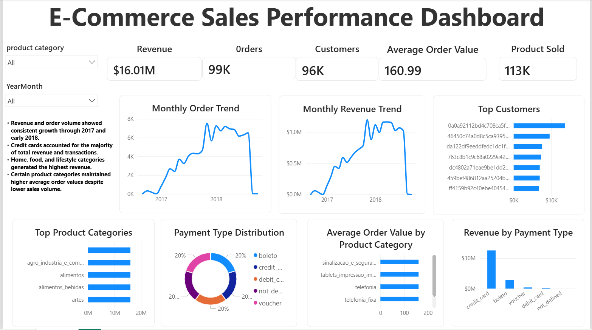

# E-Commerce Sales Performance Analysis

## Overview
This project analyzes e-commerce sales data using SQL and Power BI to uncover insights related to revenue growth, customer behavior, product performance, and payment trends.

The project combines SQL analysis with an interactive Power BI dashboard to support business decision-making through data-driven insights.

---

# Business Questions
This analysis was conducted to answer the following questions:

- How has revenue changed over time?
- Which product categories generate the highest revenue?
- Who are the highest-value customers?
- Which payment methods are most commonly used?
- What categories have the highest average order value?
- Are top-performing categories driven by order volume or premium pricing?

---

# Tools & Technologies
- SQL (MySQL)
- Power BI
- DAX
- Data Cleaning
- Data Visualization
- Business Intelligence

---

# Dataset
The dataset contains e-commerce transactional data including:

- Orders
- Customers
- Products
- Payments
- Order Items

The data was cleaned and analyzed in SQL before being imported into Power BI for visualization and dashboard development.

---

# SQL Analysis
SQL was used to perform:

- Revenue analysis
- Monthly trend analysis
- Customer analysis
- Product category analysis
- Growth rate analysis
- Data quality checks

### SQL techniques used:
- JOINs
- Aggregations
- GROUP BY
- CTEs
- Window Functions
- Data Cleaning Queries

---

# Dashboard Features

## KPI Cards
- Total Revenue
- Total Orders
- Total Customers
- Average Order Value
- Total Products Sold

## Visualizations
- Monthly Revenue Trend
- Monthly Order Trend
- Top Product Categories by Revenue
- Average Order Value by Product Category
- Top Customers
- Payment Method Distribution
- Revenue by Payment Type

## Interactive Features
- Date slicer
- Product category slicer

---

# Key Insights

- Revenue showed strong and consistent growth throughout 2017 and early 2018.
- Telecommunications-related products generated the highest product-level revenue.
- Home, beauty, and technology categories consistently outperformed other categories.
- Credit cards dominated customer payment methods and revenue contribution.
- Certain categories generated high revenue through order volume, while others relied on premium pricing.
- Seasonal spikes observed in late 2017 suggest promotional or holiday-driven purchasing behavior.

---

# Business Recommendations

- Increase inventory allocation for high-performing product categories.
- Develop retention strategies for high-value customers.
- Expand marketing efforts during high-performing seasonal periods.
- Optimize pricing strategies for premium product categories.
- Prioritize top-performing categories in future business campaigns.

---

# Dashboard Preview

## Main Dashboard


---

# Project Structure

```text
ecommerce-sales-analysis/
│
├── dashboard/
│   └── ecommerce_dashboard.pbix
│
├── sql_queries/
│   └── analysis_queries.sql
│
├── screenshots/
│   └── dashboard_overview.png
│
└── README.md
```

---

# Skills Demonstrated

- SQL Data Analysis
- Data Cleaning
- Data Visualization
- Dashboard Design
- Power BI Development
- Business Intelligence
- Analytical Thinking
- Business Performance Analysis

---

# Author

Azeemah

